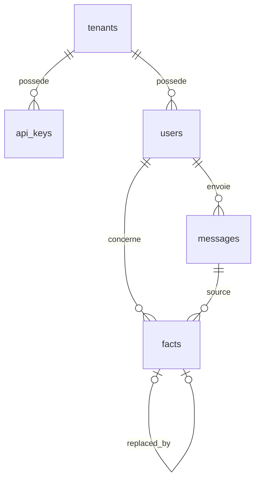

# Architecture QUOREX v1

Statut : brouillon de travail, à valider à deux avant la première migration.
Toute modification passe par une PR et, si elle change une décision, par une fiche dans `docs/decisions/`.

## 1. Résumé

QUOREX est une mémoire de faits pour agent IA. Un client (le tenant) envoie ce que ses utilisateurs disent, QUOREX en extrait des faits structurés (sujet, attribut, valeur), détecté ceux qui contredisent un fait existant, clôt l'ancien et enregistre le nouveau. L'agent ne relit que ce qui est vrai maintenant.

Chaque fait est bitemporel : il porte quand il est vrai dans la vie de l'utilisateur (`valid_from`, `valid_to`) et quand le système l'appris (`recorded_at`). Rien n'est jamais supprimé physiquement, ce qui permet de relire la mémoire telle qu'elle était à une date passée (`as_of`) et de calculer ce qui a changé entre deux dates (`diff`).

La v1 expose une API HTTP avec quatre opérations : `remember` (texte libre ou fait structuré), `recall`, `diff`, `forget`. Pas de SDK, pas de MCP, extraction synchrone. Stockage PostreSQL + pgvector derrière une interface `FactStore`. Embeddings locaux (multilangual-e5). Extraction et arbitrage par un LLM derrière une interface `LLMProvider`, Gemini en v1.

Hors périmètre v1: synthèse en texte, mémoire partagée entre utilisateurs, graphe de relations entre sujets, extraction asynchrone, on-premise.

## 2. Modèle de données

### 2.1 Schéma SQL (première migration)

```sql
CREATE EXTENSION IF NOT EXISTS vector;

CREATE TABLE tenants (
    id uuid PRIMARY KEY,
    name text NOT NULL,
    embedding_model text NOT NULL,
    embedding_dim integer NOT NULL,
    created_at timestamptz NOT NULL DEFAULT now()
);

CREATE TABLE api_keys (
    id uuid PRIMARY KEY,
    tenant_id uuid NOT NULL REFERENCES tenants(id),
    key_hash text NOT NULL UNIQUE,
    key_prefix text NOT NULL,
    label text,
    created_at timestamptz NOT NULL DEFAULT now(),
    revoked_at timestamptz
);
CREATE INDEX api_keys_tenant_idx ON api_keys(tenant_id);

CREATE TABLE users (
    id uuid PRIMARY KEY,
    tenant_id uuid NOT NULL REFERENCES tenants(id),
    external_id text NOT NULL,
    created_at timestamptz NOT NULL DEFAULT now(),
    UNIQUE (tenant_id, external_id)
);

CREATE TABLE messages (
    id uuid PRIMARY KEY,
    tenant_id uuid NOT NULL REFERENCES tenants(id),
    user_id uuid NOT NULL REFERENCES users(id),
    content text NOT NULL,
    received_at timestamptz NOT NULL DEFAULT now(),
    extraction_model text,
    extraction_raw jsonb
);
CREATE INDEX messages_user_received_idx ON messages(user_id, received_at DESC);

CREATE TYPE durability AS ENUM ('permanent', 'durable', 'transient');
CREATE TYPE end_reason AS ENUM ('replaced', 'invalidated', 'expired', 'forgotten');

CREATE TABLE facts (
    id uuid PRIMARY KEY,
    tenant_id uuid NOT NULL REFERENCES tenants(id),
    user_id uuid NOT NULL REFERENCES users(id),
    subject text NOT NULL,
    attribute text NOT NULL,
    attribute_raw text NOT NULL,
    value text NOT NULL,
    confidence real NOT NULL CHECK (confidence BETWEEN 0 AND 1),
    durability durability NOT NULL,
    expires_at timestamptz,
    source_message_id uuid REFERENCES messages(id),
    valid_from timestamptz NOT NULL,
    valid_to timestamptz,
    recorded_at timestamptz NOT NULL DEFAULT now(),
    replaced_by uuid REFERENCES facts(id),
    end_reason end_reason,
    attribute_embedding vector(768),
    value_embedding vector(768),
    CHECK ((valid_to IS NULL) = (end_reason IS NULL)),
    CHECK (replaced_by IS NULL OR end_reason = 'replaced'),
    CHECK (durability <> 'transient' OR expires_at IS NOT NULL)
);

CREATE UNIQUE INDEX facts_active_unique
    ON facts(user_id, subject, attribute) WHERE valid_to IS NULL;

CREATE INDEX facts_user_active_idx ON facts(user_id) WHERE valid_to IS NULL;

CREATE INDEX facts_user_time_idx ON facts(user_id, recorded_at, valid_from, valid_to);

CREATE INDEX facts_expiry_idx ON facts(expires_at) WHERE valid_to IS NULL AND expires_at IS NOT NULL;

CREATE INDEX facts_attr_embedding_idx ON facts
    USING hnsw (attribute_embedding vector_cosine_ops);

CREATE TABLE synonyms (
    canonical text NOT NULL,
    variant text NOT NULL,
    PRIMARY KEY (variant)
);
```

Remarques : 

- `vector(768)` est fixé par le modèle par défaut. Si un tenant utilise un autre modèle, sa dimension diffère : en v1, un seul modèle pour toute l'instance, la colonne `tenants.embedding_model` prépare la suite sans la faire.
- La dimension est stockée pour détecter un changement de modèle au démarrage : si le modèle configuré ne correspond pas à `embedding_dim`, le service refuse de démarrer et propose la commande ré-embedding.
- Toute table portant des données à `tenant_id`. Toute requête de lecture filtre dessus. La row-level security n'est pas active en v1, mais le schéma le permet.

### 2.2 Relations



## 3. Flux remember (texte libre)

```mermaid
sequenceDiagram
    participant C as Client
    participant API as api/
    participant EX as extraction/
    participant LLM as LLMProvider
    participant N as normalisation
    participant CT as contradiction/
    participant EMB as EmbeddingProvider
    participant ST as FactStore
 
    C->>API: POST /v1/remember {user, text}
    API->>API: auth clé → tenant ; résout user
    API->>ST: insère message
    API->>EX: extraire(text)
    EX->>LLM: complete_json(prompt, schema)
    LLM-->>EX: [{subject, attribute, value, confidence, durability, expires_at?}]
    alt JSON invalide ou vide
        EX-->>API: 0 fait, raison
        API-->>C: 200 {facts: [], warnings: [...]}
    end
    loop pour chaque fait extrait
        EX->>N: normaliser(attribute)
        N-->>EX: attribute canonique
        EX->>EMB: embed(attribute), embed(value)
        EX->>CT: résoudre(user, subject, attribute, embedding)
        CT->>ST: fait actif exact (user, subject, attribute) ?
        alt (a) trouvé
            CT-->>EX: REPLACE ancien
        else
            CT->>ST: voisins actifs par similarité d'attribut
            alt (b) similarité ≥ 0,85
                CT-->>EX: REPLACE ancien
            else (c) 0,70 ≤ similarité < 0,85
                CT->>LLM: complete_json(prompt arbitrage)
                LLM-->>CT: same | different
                CT-->>EX: REPLACE ou CREATE
            else
                CT-->>EX: CREATE
            end
        end
        EX->>ST: transaction : clore ancien (valid_to, end_reason) + créer nouveau + replaced_by
    end
    API-->>C: 200 {facts: [{id, action: created|replaced, replaced_fact_id?}]}
```

Règles appliquées dans la boucle : 

- Un fait `transient` ne déclenche jamais REPLACE sur un fait `durable` ou `permanent` : il est créé à côté, avec `expires_at`.
- Si le LLM est indisponible à l'extraction : 503 `llm_unvailable`, le message est quand même stocké, rien d'autre n'est écrit. Le client peut rejouer.
- Si le LLM est indisponible à l'arbitrage (c) : on ne remplace pas, on crée, et on marque le fait avec un `warning` dans la réponse. Mieux vaut un doublon qu'une perte.
- Un fait extrait avec `confidence < 0.5` n'est pas écrit, il est renvoyé dans `warning`.

### 4. Flux remmeber (structuré)

Même chemin sans extraction ni embedding de valeur. `POST /v1/remember` avec `{user, subject?, attribute, value, durability?, valid_from?}`. Normalisation, puis niveau (a) uniquement si l'attribut normalisé correspond exactement ; sinon niveaux (b) et (c) comme ci-dessus. Le LLM n'est jamais appelé au niveau (a). Déterministe, sans coût, c'est le chemin de la démo.

## 5. Flux recall et diff

### 5.1 recall

`POST /v1/recall {user, query?, attributes?, as_of?, limit?}`

- Sans `as_of` : `WHERE user_id = ? AND valid_to IS NULL AND (expires_at IS NULL OR expires_at > now())`
- Avec `as_of` : `WHERE user_id = ? AND recorded_at <= as_of AND valid_from <= as_of AND (valid_to IS NULL OR valid_to > as_of)`. C'est la condition bitemporelle complète : ce que le système savait à cette date, et qui était vrai à cette date.
- `attributes` : filtre sur la liste, après normalisation.
- `query` : embedding de la requête, tri par similarité sur `value_embedding` puis `attribute_embedding`. Sans `query`, tri par `recorded_at DESC`.
- Retour : `{facts: [{id, subject, attribute, value, confidence, durability, valid_from, valid_to, recorded_at, source_message_id, score?}]}`. Jamsi de text synthétisé.

### 5.2 diff

`POST /v1/diff {user, from, to}`

- `added` : `recorded_at` dans (from, to] et non clos avant `to`.
- `replaced` : faits avec `valid_to` dans (from, to] et `end_reason = 'replaced'`, chacun son `replaced_by`.
- `invalidated` : `valid_to` dans (from, to] et `end_reason IN ('invalidated', 'expired', 'forgotten')`.

### 5.3 forget

`POST /v1/forget {user, fact_id}` ou `{user, attribute}` : clôt le ou les faits actifs avec `end_reason = 'forgotten'`. Jamais de DELETE. un `forget`de tout l'utilisateur (`{user}` seul) clôt tout, idem.

### 6. Interfaces

### 6.1 Normalisation
 
`normalize(attribute_raw) -> attribute` : minuscules, accents retirés (NFKD), espaces et tirets en `_`, caractères non alphanumériques supprimés, puis lookup dans `synonyms` (variant → canonical). Pure, testée exhaustivement. Le fichier `synonyms.yaml` est versionné et chargé en base à la migration.
 
### 6.2 FactStore
 
```python
class FactStore(Protocol):
    def get_active(self, user_id, subject, attribute) -> Fact | None: ...
    def find_similar_active(self, user_id, attribute_embedding, limit) -> list[tuple[Fact, float]]: ...
    def list_active(self, user_id, attributes=None, expires_after=None) -> list[Fact]: ...
    def list_as_of(self, user_id, as_of, attributes=None) -> list[Fact]: ...
    def diff(self, user_id, from_, to) -> Diff: ...
    def create(self, fact: NewFact) -> Fact: ...
    def replace(self, old_id, new: NewFact, reason: EndReason) -> tuple[Fact, Fact]: ...   # atomique
    def close(self, fact_id, reason: EndReason, at=None) -> Fact: ...
    def search(self, user_id, query_embedding, as_of=None, limit=20) -> list[tuple[Fact, float]]: ...
```
 
Contrat :
 
- `replace` est atomique : soit l'ancien est clos et le nouveau créé et lié, soit rien. Sur violation de `facts_active_unique` (écriture concurrente), l'implémentation relit et rejoue une fois, puis lève `ConcurrentWrite`.
- Aucun appelant ne connaît SQL. Aucun import de SQLAlchemy ou psycopg hors de `storage/`. Un test d'import le vérifie.
- Une implémentation future doit garantir : atomicité de `replace`, unicité du fait actif par (user, subject, attribute), filtre bitemporel exact dans `list_as_of`, isolation stricte par `tenant_id`.
### 6.3 LLMProvider
 
```python
class LLMProvider(Protocol):
    def complete_json(self, prompt: str, schema: dict, *, timeout_s: float = 10) -> dict: ...
```
 
Erreurs : `LLMUnavailable` (réseau, quota, 5xx), `LLMInvalidOutput` (JSON non conforme au schéma après une tentative de réparation). Le provider est choisi par `QUOREX_LLM_PROVIDER` ; `gemini` en v1. Un `FakeLLMProvider` renvoie des sorties fixées pour les tests d'acceptation.
 
Schéma d'extraction (sortie attendue) :
 
```json
{
  "facts": [
    {
      "subject": "user",
      "attribute": "couleur préférée",
      "value": "rouge",
      "confidence": 0.9,
      "durability": "durable",
      "expires_at": null,
      "invalidates": null
    }
  ]
}
```
 
`invalidates` : attribut qu'un message rend faux sans le remplacer (« Julie est partie » → `{"attribute": "manager", "value": null, "invalidates": "manager"}`). Produit un `close` avec `end_reason = 'invalidated'`.
 
Exemples d'entrée/sortie pour les cinq scénarios de l'audit : à écrire dans `docs/extraction-examples.md` et utilisés comme fixtures du `FakeLLMProvider`.
 
### 6.4 EmbeddingProvider
 
```python
class EmbeddingProvider(Protocol):
    model_name: str
    dim: int
    def embed(self, texts: list[str]) -> list[list[float]]: ...
```
 
Changement de modèle : refus de démarrer si `dim` ne correspond pas à `tenants.embedding_dim`. Commande `quorex reembed --model X` qui recalcule toutes les colonnes vector en batch, puis met à jour `tenants`. Pas de mélange de modèles dans une même instance en v1.
 
## 7. Authentification et tenants
 
- Une clé API = `qx_` + 8 caractères de préfixe + 32 caractères aléatoires. Seul le hash argon2id est stocké ; le préfixe permet de retrouver la ligne, le hash la vérifie.
- Chaque requête : lookup par préfixe, vérification du hash, `revoked_at IS NULL`, puis `tenant_id` injecté dans le contexte. Toute requête `FactStore` reçoit ce `tenant_id` et l'ajoute au `WHERE`.
- Un `user` est toujours résolu par (`tenant_id`, `external_id`), créé à la volée au premier `remember`.
- Révocation : `revoked_at` renseigné, la clé est refusée immédiatement. Rotation : créer une nouvelle clé, migrer le client, révoquer l'ancienne.
- Un test d'acceptation vérifie qu'une clé du tenant A ne peut lire aucun fait du tenant B, même avec un `external_id` identique.
## 8. Grille d'erreurs API
 
Toute erreur : `{ "error": { "code", "message", "details"? , "request_id" } }`.
 
| HTTP | code | Quand |
|---|---|---|
| 401 | `invalid_api_key` | clé absente, inconnue ou révoquée |
| 404 | `user_not_found` | `recall`, `diff`, `forget` sur un user jamais vu |
| 404 | `fact_not_found` | `forget` par id inconnu ou d'un autre user |
| 422 | `invalid_request` | validation Pydantic, `details` liste les champs |
| 422 | `invalid_time_range` | `from >= to`, `as_of` dans le futur |
| 409 | `concurrent_write` | conflit non résolu après retry |
| 409 | `fact_rejected` | confiance trop basse, transitoire sans expiration ; `details.reason` |
| 429 | `rate_limited` | quota du tenant dépassé ; `Retry-After` |
| 503 | `llm_unavailable` | extraction impossible ; le message est stocké, rejouable |
| 500 | `internal_error` | tout le reste ; jamais de stack ni de `str(e)` dans le corps |
 
## 9. Observabilité
 
Log JSON structuré par requête, un événement par étape :
 
- Toujours : `request_id`, `tenant_id`, `user_id`, `route`, `duration_ms`, `status`.
- `remember` : `facts_extracted`, `facts_created`, `facts_replaced`, `facts_rejected`, `llm_calls`, `llm_ms`, `contradiction_levels` (compte par niveau a/b/c).
- `recall` : `as_of`, `candidates`, `returned`, `top_score`.
- Jamais le contenu des messages ni des valeurs en clair au niveau INFO ; en DEBUG uniquement, désactivé en prod.
Le `request_id` est renvoyé dans l'en-tête de réponse et dans les erreurs.
 
## 10. Concurrence
 
Deux `remember` simultanés sur le même (user, subject, attribute) :
 
1. Les deux passent le niveau (a) sans trouver de fait actif (ou trouvent le même).
2. Les deux tentent la transaction `replace` ou `create`.
3. Le premier commit réussit. Le second viole `facts_active_unique`.
4. L'implémentation attrape la violation, relit le fait actif, rejoue une fois en `replace` du fait qui vient d'être créé.
5. Si la seconde tentative échoue encore : `409 concurrent_write`.
Résultat : un seul fait actif, l'autre clos avec `replaced`, l'ordre reflète l'ordre de commit. Déterministe et vérifié par un test qui lance 20 écritures concurrentes.
 
Expiration des transitoires : pas de tâche de fond en v1. À la lecture, un fait avec `expires_at <= now()` est exclu ; à la première écriture qui le rencontre au niveau (a), il est clos avec `expired`.
 
## 11. Configuration
 
Variables d'environnement, toutes obligatoires sauf mention :
 
`QUOREX_DATABASE_URL`, `QUOREX_EMBEDDING_MODEL` (défaut `intfloat/multilingual-e5-base`), `QUOREX_LLM_PROVIDER` (`gemini` | `fake`), `QUOREX_GEMINI_API_KEY`, `QUOREX_GEMINI_MODEL`, `QUOREX_SIM_MATCH` (défaut 0.85), `QUOREX_SIM_AMBIGUOUS` (défaut 0.70), `QUOREX_MIN_CONFIDENCE` (défaut 0.5), `QUOREX_LOG_LEVEL`.
 
Le service refuse de démarrer si une variable obligatoire manque ou si la dimension du modèle ne correspond pas à la base.
 
## 12. Hors périmètre v1
 
Synthèse en texte dans `recall`. SDK. MCP. Extraction asynchrone et file d'attente. Plusieurs modèles d'embedding par instance. Row-level security. Mémoire partagée entre utilisateurs ou entre agents. Relations entre sujets (graphe). Tâche de fond d'expiration. Interface d'administration. Facturation.